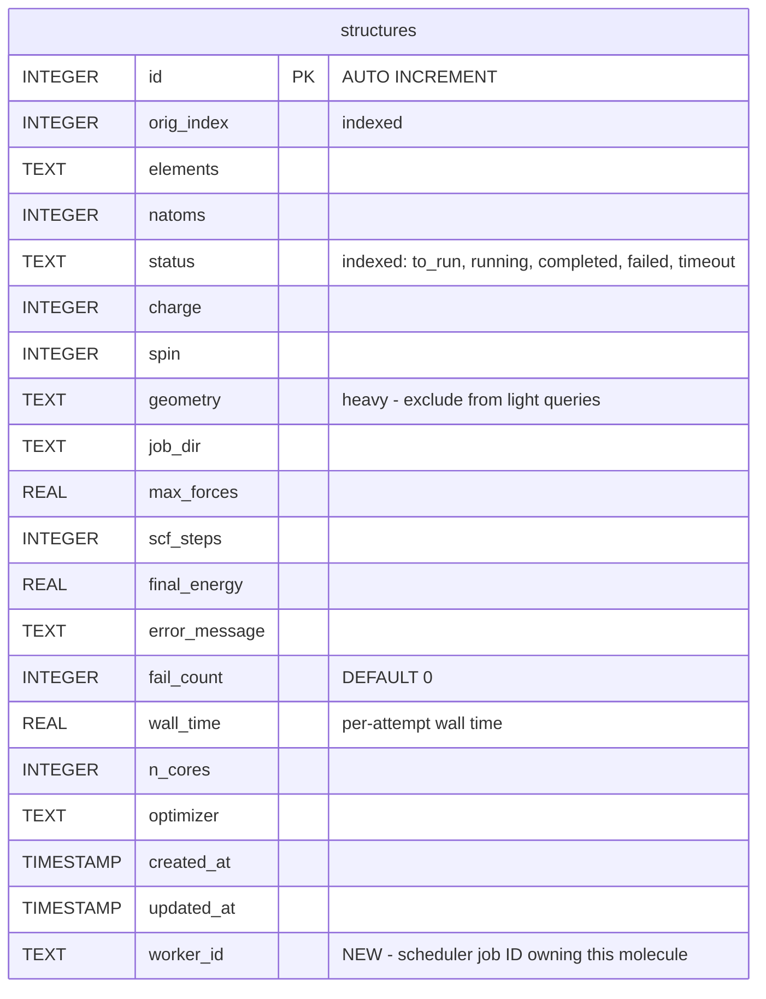
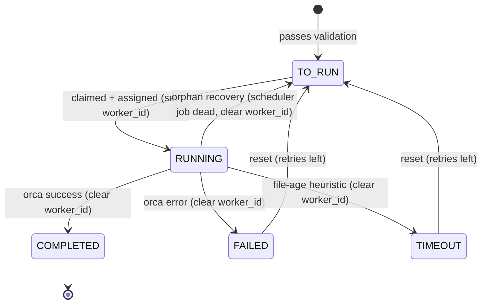

# Workflow Crash Recovery and Status Cleanup

## Overview

Fix the workflow system so that jobs stuck in RUNNING after SLURM/Flux kills an allocation are automatically detected and recovered. Add a `worker_id` column for traceability, register signal handlers for graceful Parsl shutdown, and add a `--recover-orphans` dashboard command that checks scheduler job liveness. Also clean up the longstanding `ready` vs `to_run` status inconsistency.

## Problem Statement

### 1. Jobs get stuck in RUNNING when the scheduler kills an allocation

When SLURM hits its walltime limit or a user runs `scancel`, the allocation is terminated. In Parsl mode, the Python controller process is killed, and any jobs it was managing stay in RUNNING forever. The only recovery today is manually running `dashboard --update` and waiting for the file-age timeout heuristic to eventually mark them (6-24 hours later).

**Three failure modes, three different behaviors:**

| Scenario | Signal | Python cleanup runs? | Jobs recovered? |
|---|---|---|---|
| Ctrl+C | SIGINT | Yes (KeyboardInterrupt -> finally) | Yes -- orphan reset in finally block |
| `scancel` / SLURM walltime | SIGTERM, then SIGKILL after ~30s | Not currently -- SIGTERM is not caught | No -- stuck as RUNNING |
| Node crash / OOM kill | SIGKILL (immediate) | No -- impossible | No -- stuck as RUNNING |

### 2. No way to identify which scheduler job owned a molecule

When debugging a stuck RUNNING job, there is no record of which SLURM/Flux allocation was processing it. You have to manually correlate timestamps and job directories with scheduler logs.

### 3. Status inconsistency (ready vs to_run)

- `create_workflow_db()` inserts with `status="ready"` (legacy)
- `reset_failed_jobs()` resets to `TO_RUN` (new standard)
- Parsl orphan cleanup resets to `READY` (legacy)
- `filter_jobs_for_submission()` queries both `[TO_RUN, READY]` to paper over this

## Proposed Solution

A focused set of changes that cover all three failure modes:

1. **SIGTERM handler** -- catch SLURM's termination signal and trigger the existing orphan cleanup (covers `scancel` and walltime)
2. **`atexit` handler** -- belt-and-suspenders fallback for normal and some abnormal exits
3. **`worker_id` column** -- record the scheduler job ID (`$SLURM_JOB_ID` / `$FLUX_JOB_ID`) that owns each RUNNING job
4. **`--recover-orphans` dashboard command** -- query the scheduler to check if the `worker_id` jobs are still alive; if not, reset those molecules to TO_RUN
5. **Status cleanup** -- migrate `ready` -> `to_run`, remove READY from code paths

This covers:
- **SIGINT**: already works (no change needed)
- **SIGTERM (scancel/walltime)**: new signal handler gives ~30s grace period for clean reset
- **SIGKILL/crash**: `worker_id` + `--recover-orphans` detects dead scheduler jobs and resets orphans

## Technical Approach

### Phase 1: Schema and Status Cleanup

**Add `worker_id` column and fix status inconsistency.**

This is a minimal, safe schema change using the existing `_ensure_schema()` pattern.

**New column:**

| Column | Type | Default | Description |
|--------|------|---------|-------------|
| `worker_id` | TEXT | NULL | Scheduler job ID that owns this molecule (e.g., SLURM job ID, Flux job ID). Set when marked RUNNING, cleared on completion/failure/reset. |

**Migration (in `_ensure_schema()`):**
- `ALTER TABLE structures ADD COLUMN worker_id TEXT DEFAULT NULL` (same pattern as `optimizer`)
- `UPDATE structures SET status = 'to_run' WHERE status = 'ready'` (one-time migration)

**Code changes:**

*`oact_utilities/utils/architector.py` -- `_init_db()`*
- Add `worker_id TEXT` to CREATE TABLE
- Change initial status from `"ready"` to `"to_run"`

*`oact_utilities/workflows/architector_workflow.py`*
- Add `worker_id` migration to `_ensure_schema()`
- Add `worker_id` to `_LIGHT_COLS` and `JobRecord`
- Update `_row_to_record()`: switch to `sqlite3.Row` (dict-style access by column name) instead of positional indexing. This eliminates a fragile pattern where ALTER TABLE appends columns to the end but CREATE TABLE could place them anywhere. This is a prerequisite before adding any new columns.
- Add `get_running_jobs_by_worker(worker_id)` query method
- Remove `READY` from `filter_jobs_for_submission()` -- query only `[TO_RUN]`

*`oact_utilities/workflows/submit_jobs.py`*
- Orphan cleanup: reset to `TO_RUN` instead of `READY`
- Prep failure rollback: reset to `TO_RUN` instead of `READY`

**Tasks:**
- [ ] Switch `_row_to_record()` to use `sqlite3.Row` (dict-style access)
- [ ] Add `worker_id TEXT` to `_init_db()` CREATE TABLE
- [ ] Add `worker_id` migration to `_ensure_schema()`
- [ ] Add `ready` -> `to_run` migration to `_ensure_schema()`
- [ ] Change `create_workflow_db()` to insert `status="to_run"` instead of `"ready"`
- [ ] Add `worker_id` to `_LIGHT_COLS` and `JobRecord`
- [ ] Add `get_running_jobs_by_worker(worker_id)` query method
- [ ] Update `filter_jobs_for_submission()` to query only `[TO_RUN]`
- [ ] Update all orphan cleanup / prep failure code to use `TO_RUN` instead of `READY`
- [ ] Write migration tests (old DB opens with new code, ready->to_run converted, worker_id exists)

**Success criteria:**
- Old databases auto-migrate on open (worker_id added, ready->to_run converted)
- `_row_to_record()` uses column names, not positions
- No remaining references to `JobStatus.READY` in submission code paths

### Phase 2: SIGTERM Handler and Graceful Shutdown

**Make Parsl mode survive SLURM termination signals.**

When SLURM sends SIGTERM (walltime limit, scancel, preemption), the Python process currently dies without cleanup. We register a flag-based signal handler that triggers a clean exit at a safe point between DB writes -- this completely eliminates the risk of interrupting a SQLite commit.

**Why flag-based, not exception-based:** Raising `KeyboardInterrupt` inside a signal handler can land mid-commit and corrupt the Python connection object (SQLite's journal protects the file, but the Python `sqlite3.Connection` may be unusable). A flag-based approach ensures the signal is only acted on between jobs, when no DB operation is in progress.

**Implementation in `submit_batch_parsl()`:**

```python
import signal

# Detect current scheduler job ID for worker_id tracking.
# SLURM uses numeric IDs (e.g., "12345").
# Flux uses compact alphanumeric IDs (e.g., "f2xgUVYLJs27").
# Fallback to PID for local testing without a scheduler.
_scheduler_job_id = (
    os.environ.get("SLURM_JOB_ID")
    or os.environ.get("FLUX_JOB_ID")
    or f"pid_{os.getpid()}"
)

# ... parsl.load(config) happens here ...

# IMPORTANT: Register SIGTERM handler AFTER parsl.load() -- Parsl may
# register its own signal handlers during load() which would overwrite ours.
_shutdown_requested = False
_original_sigterm = signal.getsignal(signal.SIGTERM)

def _sigterm_handler(signum, frame):
    nonlocal _shutdown_requested
    _shutdown_requested = True
    print("\nSIGTERM received -- finishing current DB write, then shutting down...")

signal.signal(signal.SIGTERM, _sigterm_handler)
```

Signal handlers run on the main thread in CPython, and the flag is checked on the main thread in the `as_completed()` loop, so no synchronization is needed. The CPython GIL ensures boolean assignment is atomic.

**Set `worker_id` on job claim:**

Add a `worker_id` parameter to `mark_jobs_as_running()` so both status and worker_id are set in a single UPDATE/commit. On completion/failure/reset, `update_status()` automatically clears `worker_id` to NULL when transitioning away from RUNNING (add `worker_id` as an optional parameter to `update_status()` and `update_status_bulk()`).

**Update the `as_completed()` monitoring loop:**

The shutdown flag check is inserted at the end of each iteration of the `as_completed()` loop -- after all DB writes for that future are done (status update, metrics extraction, etc., currently lines 1082-1147 in submit_jobs.py). This is the only safe point where no transaction is in progress.

```python
try:
    for future in as_completed(futures_map.keys()):
        job_id, job_dir = futures_map[future]
        try:
            result = future.result()
            # ... existing result handling (lines 1085-1137): update_status,
            # update_job_metrics, etc. All DB writes complete before flag check.
        except Exception as e:
            workflow.update_status(
                job_id, JobStatus.FAILED,
                error_message=str(e), increment_fail_count=True, worker_id=None,
            )
            failed_ids.append(job_id)

        # Check shutdown flag AFTER all DB writes for this future complete.
        # This is the safe point -- no transaction is in progress.
        if _shutdown_requested:
            print("Shutdown requested -- exiting monitoring loop...")
            break  # Clean exit to finally block

except KeyboardInterrupt:
    # Ctrl+C (SIGINT) still works via exception -- orthogonal to flag-based SIGTERM.
    print("\n\nGraceful shutdown requested...")

finally:
    resolved_ids = set(completed_ids) | set(failed_ids)
    orphaned_ids = [jid for jid in submitted_ids if jid not in resolved_ids]
    if orphaned_ids:
        # Use bulk update (single UPDATE + single commit) to stay well within
        # SLURM's ~30s SIGKILL grace window. Per-job commits on Lustre could
        # take 200 * 0.1s = 20s for 200 orphans -- too slow.
        try:
            workflow.update_status_bulk(
                orphaned_ids, JobStatus.TO_RUN, worker_id=None
            )
        except Exception:
            # Fallback: try individually if bulk fails
            for jid in orphaned_ids:
                try:
                    workflow.update_status(jid, JobStatus.TO_RUN, worker_id=None)
                except Exception:
                    pass
        print(f"Reset {len(orphaned_ids)} in-flight jobs back to TO_RUN")

    # Running Parsl workers are terminated by dfk.cleanup() below.
    # Their job IDs are already classified as orphans and reset above.

    # Restore original SIGTERM handler
    signal.signal(signal.SIGTERM, _original_sigterm)
    # ... existing Parsl dfk.cleanup() + parsl.clear() ...
```

**Edge case -- all jobs are long-running:** If no future completes within SLURM's ~30s grace window, the flag is never checked before SIGKILL arrives. This is acceptable: `--recover-orphans` (Phase 3) handles that case. In practice, with 4-16 Parsl workers running jobs that take minutes to hours, futures complete frequently enough that the flag is checked well within 30 seconds.

**Tasks:**
- [ ] Add flag-based SIGTERM handler in `submit_batch_parsl()` -- register AFTER `parsl.load()`
- [ ] Add shutdown flag check after each future result is processed in the `as_completed()` loop (after line ~1147)
- [ ] Add `worker_id` parameter to `mark_jobs_as_running()` -- set in same UPDATE/commit
- [ ] Add `worker_id` parameter to `update_status()` and `update_status_bulk()` -- auto-clear to NULL when transitioning away from RUNNING
- [ ] Update `finally` block: use `update_status_bulk()` for orphan reset (single commit, fast enough for SIGKILL grace window)
- [ ] Restore original SIGTERM handler on clean exit
- [ ] Write tests: simulate SIGTERM delivery, verify flag is set and loop exits cleanly
- [ ] Write tests: verify `worker_id` is set on claim and cleared on completion
- [ ] Write tests: verify bulk orphan reset in finally block

**Success criteria:**
- `scancel <jobid>` during Parsl execution resets all in-flight jobs to TO_RUN within seconds
- SLURM walltime limit triggers graceful shutdown (30s grace period)
- `worker_id` is populated for all RUNNING jobs and NULL for completed/failed/to_run jobs

### Phase 3: Dashboard Orphan Recovery (`--recover-orphans`)

**Detect and recover jobs orphaned by SIGKILL, node crashes, or any unclean exit.**

This is the safety net for cases where the SIGTERM flag-based handler cannot help -- SIGKILL (no Python code runs), OOM kills, and node failures. It also catches the edge case where all Parsl jobs are long-running and no future completes within the SIGTERM grace window. The dashboard queries the scheduler to check if `worker_id` jobs are still alive.

**Scheduler job liveness check (batch query):**

Collect all unique `worker_id` values from RUNNING jobs and check them against the scheduler in a single call:

```python
def get_active_scheduler_jobs(scheduler: str) -> set[str] | None:
    """Get the set of all currently active scheduler job IDs.

    Returns:
        set[str]: Job IDs of active jobs. Empty set means "nothing is running."
        None: Could not reach scheduler -- caller MUST skip recovery (conservative).
    """
    try:
        if scheduler == "slurm":
            # Get all active jobs for the current user
            result = subprocess.run(
                ["squeue", "-u", os.environ.get("USER", ""), "-h", "-o", "%A"],
                capture_output=True, text=True, timeout=30,
            )
            return set(result.stdout.strip().split("\n")) if result.stdout.strip() else set()

        elif scheduler == "flux":
            # flux jobs outputs compact alphanumeric IDs (e.g., "f2xgUVYLJs27").
            # --filter=pending,running limits to active jobs.
            # -no "{id}" outputs one job ID per line with no header.
            # These IDs match the $FLUX_JOB_ID env var format.
            result = subprocess.run(
                ["flux", "jobs", "--filter=pending,running,completing",
                 "-no", "{id}"],
                capture_output=True, text=True, timeout=30,
            )
            return set(result.stdout.strip().split("\n")) if result.stdout.strip() else set()

    except (subprocess.TimeoutExpired, FileNotFoundError, OSError):
        return None  # None means "could not check" -- caller should skip recovery

    return set()
```

**Dashboard `--recover-orphans` implementation:**

```
1. Query all RUNNING jobs that have a non-NULL worker_id
2. Collect unique worker_id values
3. Call get_active_scheduler_jobs() once to get all active job IDs
4. For each RUNNING job whose worker_id is NOT in the active set:
   a. Check output file on disk (content-based: completed? failed? inconclusive?)
   b. If completed on disk: mark COMPLETED, extract metrics
   c. If failed on disk: mark FAILED
   d. If inconclusive (no output or partial): reset to TO_RUN, clear worker_id
5. Report: "Recovered N orphaned jobs (X completed, Y failed, Z reset to TO_RUN)"
```

This is safe because:
- Content checks run first (a completed job is never incorrectly reset)
- Only jobs whose scheduler job is confirmed dead are touched
- If the scheduler cannot be reached, no jobs are modified (conservative default)

**CLI:**

```bash
# Auto-detect scheduler from worker_id format or require explicit flag
python -m oact_utilities.workflows.dashboard db.db --recover-orphans --scheduler slurm

# Can combine with other flags
python -m oact_utilities.workflows.dashboard db.db --recover-orphans --scheduler flux --show-running
```

**Files to modify:**
- `oact_utilities/workflows/dashboard.py` -- add `--recover-orphans` and `--scheduler` flags, implement recovery logic
- `oact_utilities/utils/status.py` or new `oact_utilities/utils/scheduler.py` -- `get_active_scheduler_jobs()`, `check_scheduler_job_alive()`

**Tasks:**
- [ ] Implement `get_active_scheduler_jobs(scheduler)` -- single call to get all active jobs for current user
- [ ] Add `--recover-orphans` flag to dashboard CLI
- [ ] Add `--scheduler {slurm,flux}` flag to dashboard CLI (required with `--recover-orphans`)
- [ ] Implement recovery logic: query RUNNING with non-NULL worker_id, check scheduler, check disk, update status
- [ ] Preserve content-before-age rule: completed-on-disk jobs are marked COMPLETED, not reset
- [ ] Display `worker_id` in `--show-running` output
- [ ] Write tests with mocked `subprocess.run` for both SLURM and Flux scheduler queries
- [ ] Write tests for the full recovery flow: orphaned RUNNING job with dead scheduler ID -> TO_RUN
- [ ] Write tests for conservative behavior: scheduler unreachable -> no changes

**Success criteria:**
- After a SLURM allocation is killed, `--recover-orphans --scheduler slurm` detects and resets all orphaned jobs
- Jobs that actually completed before the kill are correctly marked COMPLETED (not reset)
- If `squeue`/`flux jobs` is unavailable, no jobs are modified (safe fallback)
- Single `squeue -u $USER` call handles all orphans (no per-job queries)

## Alternative Approaches Considered

### 1. Job completion callback (from old plan)

The outdated 2026-02-16 plan proposed having each job script call a Python callback at exit. Rejected because:
- If the job is killed (SIGKILL, OOM, walltime), the callback never runs
- SQLite from compute nodes on network filesystems is unreliable
- The SIGTERM handler + atexit + dashboard recovery approach covers all three failure modes more reliably

### 2. atexit handler as fallback

Could register an `atexit` handler to reset orphaned jobs on Python exit. Rejected because:
- The `finally` block already runs on SIGINT, SIGTERM (via new handler), and normal exit
- `atexit` does NOT run on SIGKILL (the one case `finally` also misses) -- `--recover-orphans` handles that
- Adds registration/deregistration complexity and a lifecycle dependency on the DB connection
- Zero additional failure modes covered beyond SIGTERM + `finally` + `--recover-orphans`

### 3. Persistent polling daemon (TraditionalJobManager)

Could build a long-running process that periodically polls `squeue`/`flux jobs`. Rejected because:
- Adds a new component to run and monitor (what watches the watcher?)
- The dashboard `--recover-orphans` command achieves the same result with zero infrastructure
- A cron job running `dashboard --recover-orphans` provides automation if needed

### 4. Cumulative wall-time column for timeout decisions

Could track `running_wall_time` across retries. Deferred because:
- The existing `hours_cutoff` + content-before-age heuristic works and is battle-tested
- `fail_count` + `max_fail_count` already prevents infinite retry loops
- Can be added later as a single column if needed -- the schema migration pattern supports it

### 5. QUEUED state between TO_RUN and RUNNING

Could add a QUEUED state for "claimed but not yet executing." Rejected because:
- The existing atomic claim pattern (`mark_jobs_as_running()`) already prevents TOCTOU races
- The window between claim and execution is seconds (directory preparation)
- Parsl and SLURM each have their own internal queues -- a third queue in SQLite is redundant
- Adds complexity to every query and display that checks for "in-progress" jobs

### 6. Formal state machine with transition validation

Could add a `_VALID_TRANSITIONS` dict to `update_status()`. Deferred because:
- No bugs from invalid transitions have been reported
- The team is small and code review catches misuse
- Can be added later as ~15 lines if it becomes a problem

## Acceptance Criteria

### Functional Requirements

- [ ] `worker_id` column exists and is populated for all RUNNING jobs in Parsl mode
- [ ] SIGTERM during Parsl execution triggers graceful shutdown and resets orphaned jobs to TO_RUN
- [ ] `--recover-orphans --scheduler slurm` detects jobs whose SLURM allocation is dead and resets them
- [ ] `--recover-orphans --scheduler flux` does the same for Flux
- [ ] Content-based checks still take priority (completed-on-disk jobs are marked COMPLETED, not reset)
- [ ] Old databases auto-migrate on open (worker_id added, ready->to_run converted)
- [ ] Legacy `READY` status is fully migrated to `TO_RUN`
- [ ] No remaining references to `JobStatus.READY` in submission/reset code paths

### Non-Functional Requirements

- [ ] `_row_to_record()` uses dict-style column access (no positional indexing)
- [ ] Schema migration completes in < 5 seconds for databases with 50k rows
- [ ] `--recover-orphans` makes a single scheduler query (not one per job)
- [ ] Batch commits pattern preserved (no per-job commits on Lustre)

### Quality Gates

- [ ] All existing tests pass with new schema
- [ ] New tests for: migration, SIGTERM handling, scheduler liveness checks, orphan recovery
- [ ] Manual testing on Tuolumne (Flux) and a SLURM system

## Risk Analysis and Mitigation

| Risk | Likelihood | Impact | Mitigation |
|------|-----------|--------|------------|
| Migration breaks existing DBs | Low | High | Additive-only (one ALTER TABLE); same pattern as existing `optimizer` migration |
| SIGTERM handler interferes with Parsl internals | Low | Medium | Parsl uses its own signal handling; test that both coexist. Restore original handler on exit. |
| `squeue` / `flux jobs` output format changes | Low | Low | Parse conservatively; treat unexpected output as "cannot determine" (no action taken) |
| Flux job ID format mismatch | Low | Medium | Flux uses compact alphanumeric IDs (e.g., `f2xgUVYLJs27`). Verify `$FLUX_JOB_ID` matches `flux jobs -no "{id}"` output on Tuolumne before shipping. |
| `worker_id` stale after pid reuse | Very Low | Low | PIDs are only used as fallback when no scheduler env var exists (local testing) |

## Future Considerations (Deferred)

- **Cumulative wall-time tracking**: Add `running_wall_time REAL DEFAULT 0` column for timeout decisions based on actual compute time instead of file age. The schema migration pattern supports adding this later.
- **`timeout_count` column**: Separate timeout events from error events in `fail_count`. Can be added when needed.
- **`manager_job_id` column**: Track which controller allocation owned jobs. Useful for multi-allocation workflows. The `worker_id` column covers the primary debugging need for now.
- **Formal state machine**: Add `_VALID_TRANSITIONS` dict to `update_status()` (~15 lines). Worth adding when the team grows or transition bugs appear.
- **Traditional mode scheduler monitoring**: For non-Parsl batch submissions, store the `sbatch`/`flux batch` return job ID as `worker_id` and use `--recover-orphans` to detect dead jobs.

## Documentation Plan

- Update `CLAUDE.md` with `worker_id` column, updated status lifecycle (remove READY), SIGTERM handling
- Update `oact_utilities/workflows/README.md` with `--recover-orphans` usage
- Add solution doc for SIGTERM handling pattern (useful reference for future signal issues)

## References

### Internal Code

- [submit_jobs.py:1149-1163](oact_utilities/workflows/submit_jobs.py#L1149-L1163) -- current KeyboardInterrupt + finally orphan cleanup (to be extended)
- [submit_jobs.py:540-643](oact_utilities/workflows/submit_jobs.py#L540-L643) -- `orca_job_wrapper` with timeout/kill logic
- [architector_workflow.py:230-275](oact_utilities/workflows/architector_workflow.py#L230-L275) -- `_row_to_record()` (to be refactored to dict access)
- [architector_workflow.py:108-137](oact_utilities/workflows/architector_workflow.py#L108-L137) -- `_ensure_schema()` migration pattern
- [status.py:68-110](oact_utilities/utils/status.py#L68-L110) -- `check_file_termination()` content-before-age pattern

### Documented Solutions

- `docs/solutions/logic-errors/recheck-completed-timeout-bug.md` -- content-before-age pattern (MUST preserve in orphan recovery)
- `docs/solutions/performance-issues/large-db-dashboard-hang.md` -- batch commits on Lustre
- `docs/solutions/runtime-errors/encoding-errors-corrupted-orca-files.md` -- errors='replace' on file reads

### ERD: Updated Structures Table



### State Machine Diagram



### Scheduler Liveness Check Flow

```
--recover-orphans --scheduler slurm

1. SELECT id, worker_id FROM structures WHERE status = 'running' AND worker_id IS NOT NULL
2. Collect unique worker_id values: {12345, 12346, 12347}
3. Run: squeue -u $USER -h -o "%A"  -->  active_jobs = {12347, 12400}
4. Dead jobs = {12345, 12346}  (not in active set)
5. For each molecule with worker_id in dead_jobs:
   a. check_job_termination(job_dir) on disk
   b. Result 1 (completed):  mark COMPLETED, extract metrics
   c. Result -1 (failed):    mark FAILED, store error
   d. Result 0/-2 (unclear): reset to TO_RUN, clear worker_id, increment fail_count
6. Report: "Recovered 15 orphaned jobs from 2 dead scheduler jobs"
```
